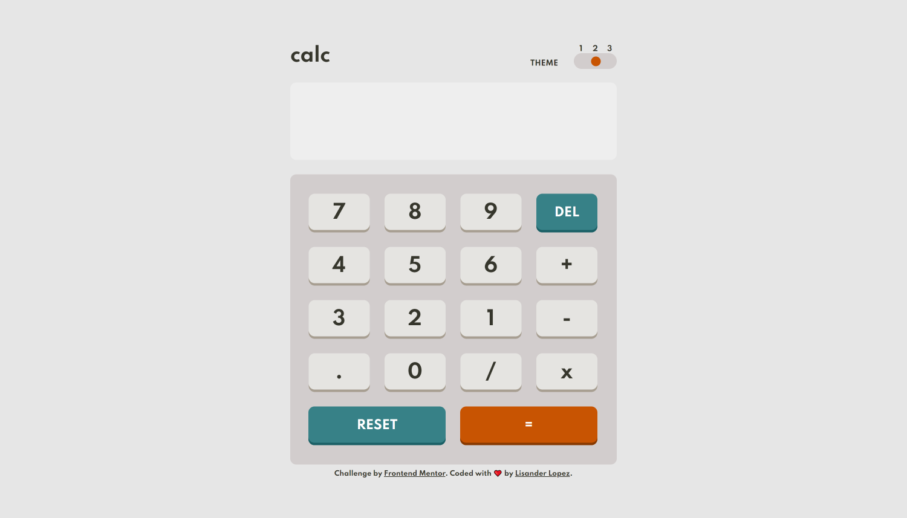

# Frontend Mentor - Calculator app solution

This is a solution to the [Calculator app challenge on Frontend Mentor](https://www.frontendmentor.io/challenges/calculator-app-9lteq5N29). Frontend Mentor challenges help you improve your coding skills by building realistic projects. 

## Table of contents

- [Frontend Mentor - Calculator app solution](#frontend-mentor---calculator-app-solution)
  - [Table of contents](#table-of-contents)
  - [Overview](#overview)
    - [The challenge](#the-challenge)
    - [Screenshot](#screenshot)
    - [Links](#links)
    - [Built with](#built-with)
    - [Useful resources](#useful-resources)
  - [Author](#author)

## Overview

### The challenge

Users should be able to:

- See the size of the elements adjust based on their device's screen size
- Perform mathmatical operations like addition, subtraction, multiplication, and division
- Adjust the color theme based on their preference
- **Bonus**: Have their initial theme preference checked using `prefers-color-scheme` and have any additional changes saved in the browser

### Screenshot

### Links

- Live Site URL: [calculator.lisanderlopez.com/](https://calculator.lisanderlopez.com/)

### Built with

- Semantic HTML5 markup
- CSS3
- Flexbox
- CSS Grid
- CSS Properties
- [React](https://reactjs.org/) - JS library
- [Next.js](https://nextjs.org/) - React framework

### Useful resources

- [Replacing Redux with Hooks](https://codeburst.io/global-state-with-react-hooks-and-context-api-87019cc4f2cf) - This helped me for XYZ reason. I really liked this pattern and will use it going forward.

## Author

- Website - [Lisander Lopez](https://lisanderlopez.com/)
- Frontend Mentor - [@lisander-lopez](https://www.frontendmentor.io/profile/lisander-lopez)
